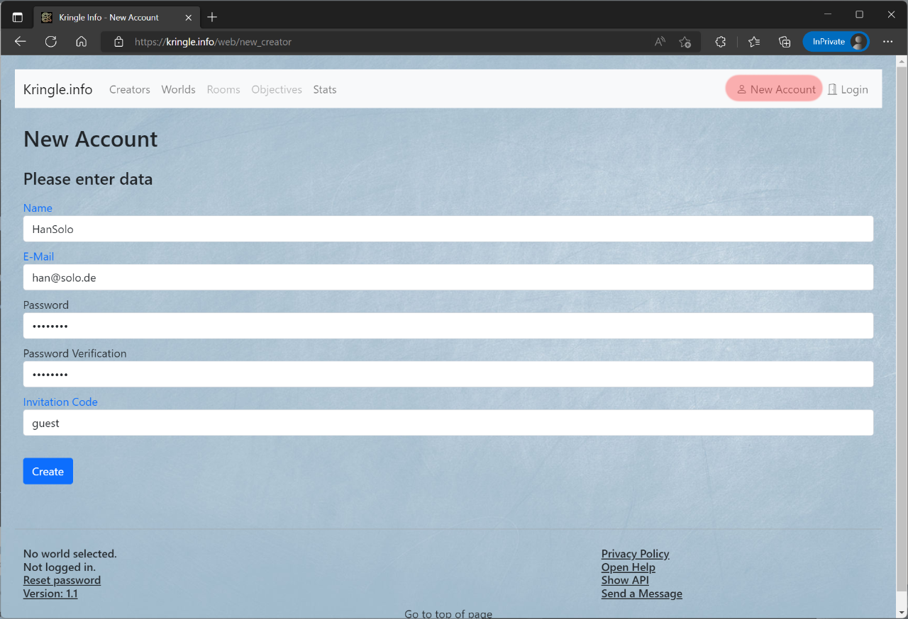

# Account

## New Account

You can create a new account by clicking on (1) *Account*. This is only possible if you are not already logged in.  

The following data is required:  

| Field            | Description         |  
| ---------------- | ------------------- |
| Name             | Your username (used for login and is displayed in the overview of the creators) |
| E-mail           | Your e-mail address (Only used to send notifications about account changes like e-mail address changes) |
| Password         | Your password (should be as secure as you want it to be) |
| Invitation Code  | The invitation code is required to create an account |

## Edit Account

If you are already logged in, you can edit your existing account by clicking on (1) *Account*.

### Enter data

In the first section, you can enter or change the following information:  

| Field       | Description         |  
| ----------- | ------------------- |
| E-mail      | Your e-mail address |
| Description | Something you want to let others know about you |
| Image       | The link to a profile picture (This is displayed in the overview of the creators. You can also use the storage area to upload an image) |

### Set new password

In the second section, you can change your password.

### Delete account

In the third section, you can delete your user account. Please be aware that all solutions which have been created by this user account will also be deleted!
