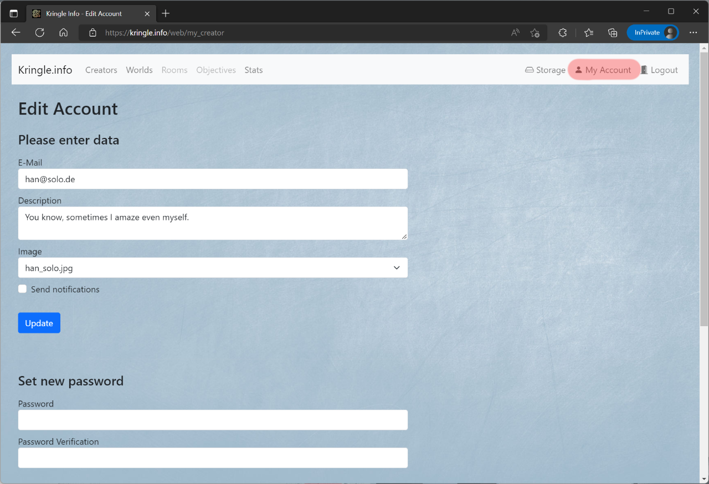

# Account

## New Account

You can create a new account by clicking on *New Account*. This is only possible if you are not already logged in.  

The following data is required:  

| Field           | Description                                                                             |
|-----------------|-----------------------------------------------------------------------------------------|
| Name            | Your username (used as login and is visible in the creators overview)                   |
| E-mail          | Your e-mail address (only used to send notifications, not visible anywhere)             |
| Password        | Your password (should be as secure as you want it to be)                                |
| Invitation Code | If you have an invitation code, you can enter it here to skip the registration workflow |

*Note*: The invitation code also decides your role (creator or registered user only).

## Login

You can log into the application by clicking on *Login*. You need to enter the username and password you have chosen before. If you select *Remember me* you will stay logged in even after closing your browser.  
To log out again, just click on *Logout*.

## Edit Account

If you are already logged in, you can edit your existing account data by clicking on *My Account*.

### Enter data

In the first section, you can enter or change the following information:  

| Field              | Description                                                                                                               |
|--------------------|---------------------------------------------------------------------------------------------------------------------------|
| E-mail             | Your e-mail address (only used to send notifications, not visible anywhere)                                               |
| Description        | Something you want to let others know about you                                                                           |
| Image              | Your profile picture (This is displayed in the creators overview. You can also use the *storage area* to upload an image) |
| Send notifications | Receive e-mail notifications in case of certain events (world have been opened for example)                               |

### Set new password

In the second section, you can change your password.

### Delete account

In the third section, you can delete your user account. Please be aware that all solutions which have been created by this user account will also be deleted!

