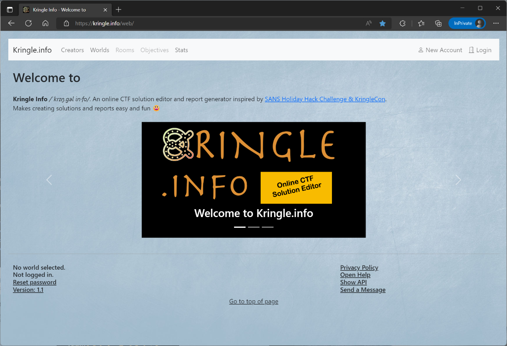

# Home

## About

Kringle.info is an online CTF solution editor and report generator inspired by SANS Holiday Hack Challenge & KringleCon. The SANS Holiday Hack Challenge happens each year and offers a lot of challenges, knowledge and fun. You can even submit a report containing your solutions and win prizes.  
In 2021 I have submitted a report in Markdown format (the ideal format in my opinion as it's easy and simple and offers code highlighting).  
I have invested some time to create a beautiful and well-structured report, so I thought it would be a good idea to automate that. Next I had the idea that even other people might find such an automation useful. I started creating a small Python script which resulted in a self-hosted full web application based on Flask, Bootstrap and Postgresql.  
It's not limited to the Kringle theme but supports any CTF based on challenges and solutions.

## Features

What does it currently offer?

- The application supports different scenarios (aka worlds) which may contain rooms and challenges (the SANS Holiday Hack Challenges are game based, also see chapter *Navigation* for more details)
    - Kringle-themed worlds may contain a variety of elements like rooms, objectives, items and persons
    - Other worlds (for any other CTF) have a reduced set of elements (just rooms and challenges)
- It does support different roles (world creators, registered and anonymous users)
    - A world creator can upload (and later modify) a world and its content in the application or by using a simple REST API
    - A registered user can submit and store a solution for each of the challenges or create reports. This standard user cannot change the world content
    - An anonymous user can view the challenges and public solutions
    - Submitted solutions can even be "liked"
- It does support registrations
    - There is a simple e-mail based registration workflow
    - There are also invitation codes for world creators and registered users which can be distributed for certain events
- It does support opening and closing worlds
    - The world creator can flag a world public, before that point of time no one is able to see other solutions (required by the Holiday Hack Challenge rules)
    - The registered user can flag each solution public, before that point of time no one is able to see it
- It does support S3 storage
    - Sometimes you need to include images in your solutions, you can upload them to a S3 bucket and easily generate Markdown links
    - Each user has a certain quota
- It does support mail sending
    - You'll get an e-mail e.g. if you have changed your password
    - There are global notifications for events like a world has been opened to the public
- It does support automatic report generation
    - You can generate a Markdown or HTML report containing all challenges and all your solutions
    - The report even contains clickable links and navigation
