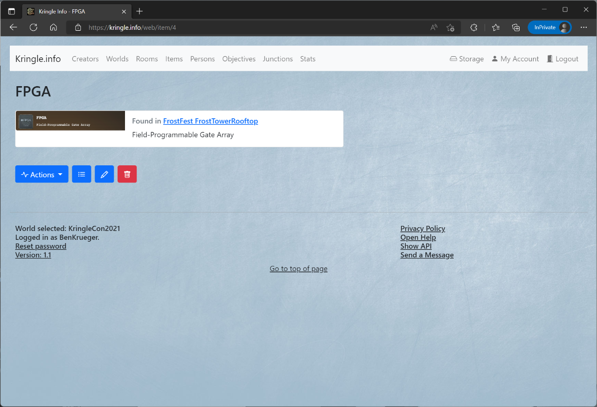

# Items

## All Items

You can see which items are available by clicking on *Items*.  
This is only possible if you have selected a world before.   

If you click on an entry, you will be taken to the detailed view.  

## Detailed View

In the detailed view you can inform yourself about the item.  
When you click on the *room*, you can jump directly to the detailed view of the respective room which this item is part of.  
If the item has an image linked, it will be displayed here as well.  
The *description* box provides brief information about this item.  

In the section below, you can access following actions:

* The *list* symbol leads back to the items overview
* The *pencil* symbol allows you to edit the item description and the linked image (`creator` role necessary, and world ownership)
* The *trashcan* symbol will irrevocably delete that item
* 
*Note*: The same actions can be accessed via the *Actions* drop-down menu

