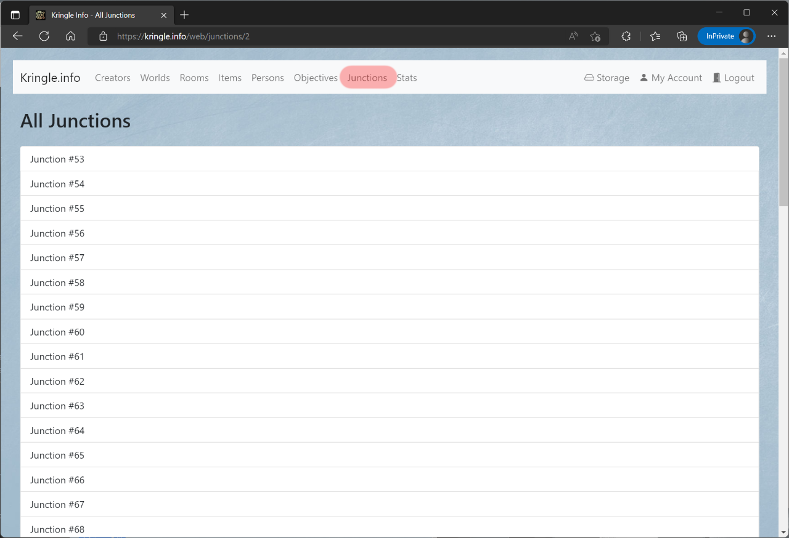
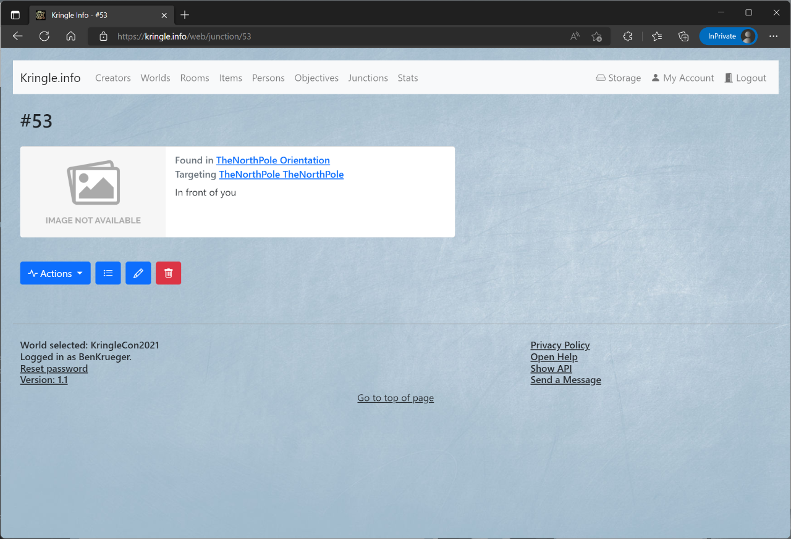

# Junctions

## All Junctions

You can see which junctions (a connection between two rooms) are there by clicking on *Junctions*.  
This is only possible if you have selected a world before.   

If you click on an entry, you will be taken to the detailed view.  

## Detailed View

In the detailed view you can inform yourself about the junction.  
When you click on the origin *room* or the destination *room*, you can jump directly to the detailed view of the respective room this junction is connecting.  
If the junction has an image linked, it will be displayed here as well.  
The *description* box provides brief information about this junction.  

In the section below, you can access following actions:

* The *list* symbol leads back to the junctions overview
* The *pencil* symbol allows you to edit the junction description and the linked image (`creator` role necessary, and world ownership)
* The *trashcan* symbol will irrevocably delete that junction

*Note*: The same actions can be accessed via the *Actions* drop-down menu

