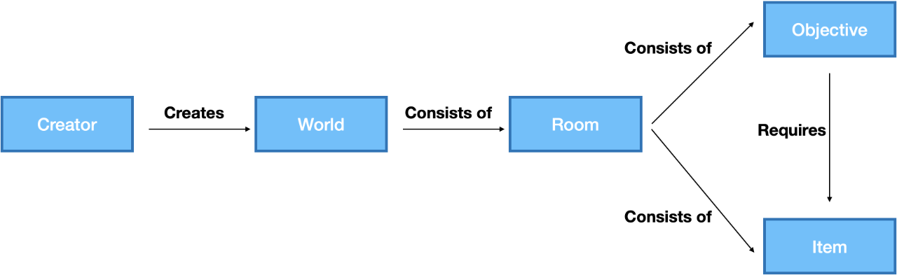

# Navigation

## Overview

The SANS Holiday Hack Challenge is game based. The application reflects that idea.

Above you can see the different elements which can be managed using the application.  

### Creators
There are different type of users

- Creators can upload whole new scenarios (aka worlds) and manage them in the application or by using a REST API
- Registered users can submit solutions for the challenges and generate reports
- Anonymous users can inspect the challenges and the solutions other people have submitted and made public

### Worlds
A world is a whole scenario. The SANS Holiday Hack Challenge is game-based and each year there is a different theme / a different world.

### Rooms
A world consists of different rooms which are linked to each other. In the original game a user can enter a room and interact with the objects found there (the characters are giving you challenges).

### Objectives
These are the challenges which need to be solved.

### Items
Sometimes you do need items to "open" challenges. That feature is not relevant for the web application.
