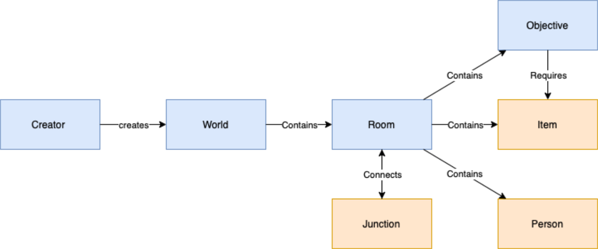

# Navigation

## Overview

The SANS Holiday Hack Challenge is game based and the challenges are embedded into a world containing different elements. The application reflects that idea in its structure.  
For any other CTF (just having challenges without that kind of gamification) the application also supports a basic set of elements.

Above you can see the different elements which can be managed by the application.  
The elements colored in blue are available for both Kringle-themed and standard worlds.  
The elements colored in orange are extra elements for Kringle-themed worlds.

## Standard elements (blue)

### Creators

The users of the application are called **Creator**s.  
There are different type of users:

- **Creator**s can upload whole new scenarios (aka worlds) and manage them in the application or by using a REST API
- Registered users can submit solutions for the challenges and generate reports
- Anonymous users can view the challenges and the solutions other people have submitted and made public

### Worlds

A **World** is a whole scenario. The SANS Holiday Hack Challenge is game-based and each year there is a different theme / a different **World**.  
Any other CTF can also be created as a **World**.

### Rooms

A world consists of different **Room**s which are linked to each other. In the original game a user can enter a room and interact with the objects found there (the characters are giving you challenges).  
Any other CTF can use **Room**s as a "folder".

### Objectives

These are the challenges which need to be solved. In the original game a character is giving you a challenge you need to solve. Each **Objective** can have a quest (the challenge itself) and solutions.  
Any other CTF can use **Objective**s for its challenges/tasks/etc.

## Kringle elements (orange)

### Items

In the original game you might need **Item**s to "open" objectives. These items can be found in a room anywhere in that world.  
These **Item**s are documented this way and not relevant for any other CTF.

### Persons

In the original game you might encounter **Person**s which are not giving you any hint or challenge.  
These **Person**s are documented this way and not relevant for any other CTF.  

### Junctions

In the original game you can go from one room to another linked room.  
These **Junction**s are documented this way and not relevant for any other CTF.
