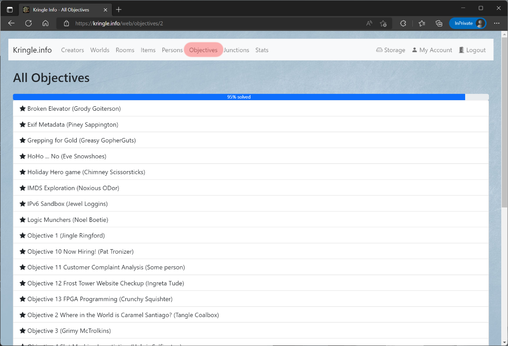

# Objectives

## All Objectives

You can see which objectives are available by clicking on the (1) *Objectives* button.  
If you click on an (2) entry, you will be taken to the detailed view.  

## Detailed View

In the detailed view you can inform yourself about the objective.  
When you click on the (1) room, you can jump directly to the detailed view of the respective room of which this objective is part.  
The (2) *Description* provides a brief information about this objective.  
The (3) *Difficulty* indicates how difficult it is to solve the challenge.  
Given the (4) *URL*, you can open the challenge directly.  
The field (5) *Supported by* lists the objective that needs to be solved in order to get more information about this specific challenge.  
The (6) *Requires* entry indicates the item that is needed before this challenge can be solved.  

The (1) *Master Quest* section shows the challenge that needs to be solved in order for this *objective* to be completed.  
The (2) *Public solutions* section displays the solutions that have been submitted for this challenge and have been marked as *public*. You can reach the solution via the (3) link. By clicking on the (4) creator you can reach the detail page for the creator. The number at (5) *votes* indicates how many times this solution has received a "like".  
By clicking on (6) *Edit master quest* you reach the editor for this quest. This function is only available to the creator of the whole *world*.  
By clicking on (7) *Edit my solution* you can reach the editor for your solution for this quest. This feature is only available to registered users.  

