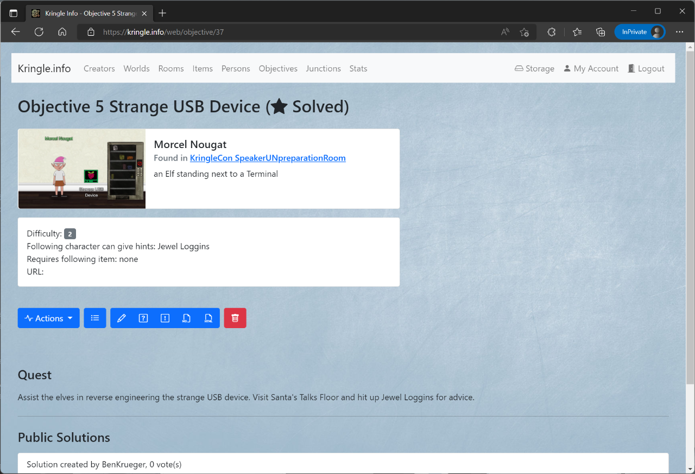
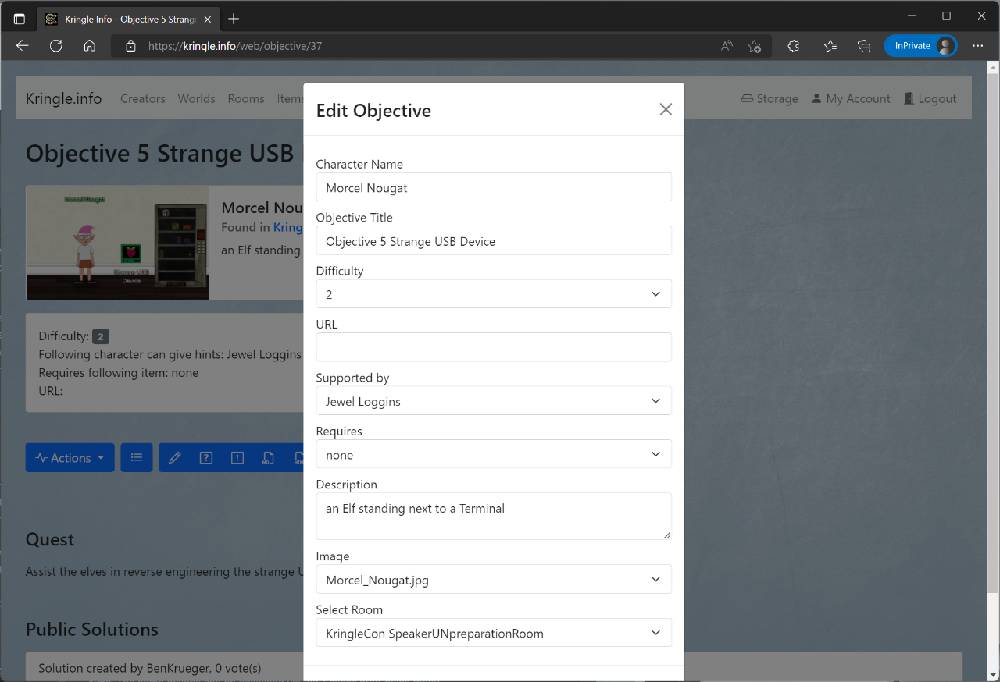

# Objectives

## All Objectives

You can see which objectives are available by clicking on *Objectives*. This is only possible if you have selected a respective world before.   
If you click on an entry, you will be taken to the detailed view.  

## Detailed View

In the detailed view you can inform yourself about the objective.  
When you click on the *room*, you can jump directly to the detailed view of the respective room of which this objective is part.  
The field *ID* shows the unique objective ID. This ID can be used for the REST API.  
The *Title* shows this objective's title.  
The *Difficulty* indicates how difficult it is to solve the challenge.  
Given the *URL*, you can open the challenge directly.  
The field *Supported by* lists the objective that needs to be solved in order to get more information about this specific challenge.  
The *Requires* entry indicates the item that is needed before this challenge can be solved.  
The *Description* below provides a brief information about this objective.  

The *Master Quest* section shows the challenge that needs to be solved in order for this *objective* to be completed.  
The *Public solutions* section displays the solutions that have been submitted for this challenge and have been marked as *public*. You can reach the solution via the respective link. By clicking on the *creator* you can reach the detail page for the creator. The number at *votes* indicates how many times this solution has received a "like".  
By clicking on *Edit master quest* you reach the editor for this quest. This function is only available to the creator of the whole *world* (user role "creator" necessary).  
By clicking on *Edit my solution* you can reach the editor for your solution for this quest. This feature is only available to registered users (user role "user" or "creator" necessary).  

