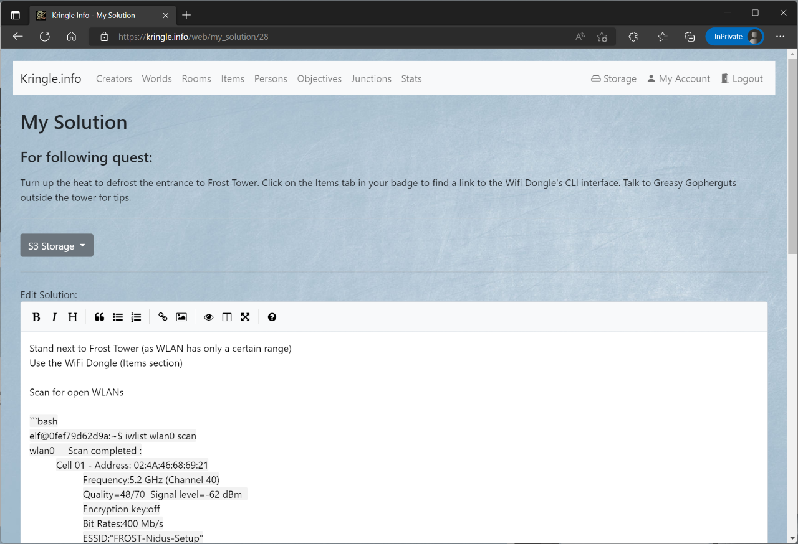
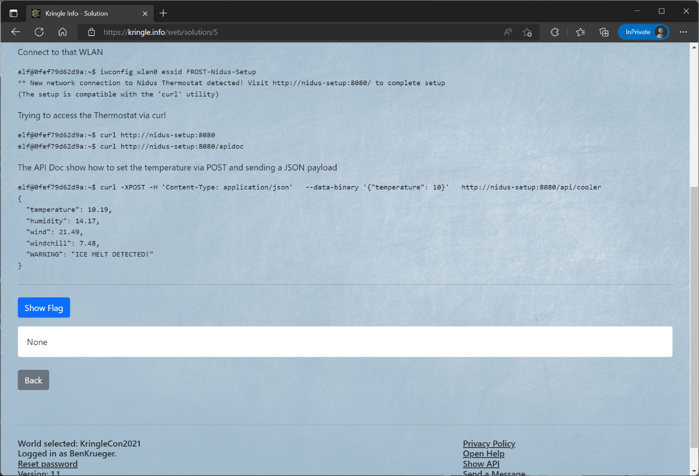

# Objectives

## All Objectives

You can see which objectives are available by clicking on *Objectives*.  
This is only possible if you have selected a respective world before.   

If you click on an entry, you will be taken to the detailed view.  

## Detailed View

In the detailed view you can inform yourself about the objective.  
When you click on the *room*, you can jump directly to the detailed view of the respective room which this objective is part of.  
If the objective has an image linked, it will be displayed here as well.  
The *description* box below provides brief information about this objective.  

The *Difficulty* indicates how difficult it is to solve the challenge.   
The field *Following character can give hints* lists the objective that needs to be solved in order to get more information about this specific challenge.  
The entry *Requires following item* indicates the item that is needed before this challenge can be solved.  
Using the *URL*, you can open the challenge directly (if it's web-based).  

In the section below, you can access following actions:  

- The *list* symbol leads back to the objectives overview
- The *pencil* symbol allows you to edit the objective description and the linked image (`creator` role necessary, and world ownership)
- The *question mark* symbol opens the editor for this quest/challenge (`creator` role necessary, and world ownership)
- The *exclamation mark* symbol opens the editor for your solution (`user` role necessary)
- The *MD* symbol lets you create a markdown report just for this single objective (`user` role necessary)
- The *HTML* symbol lets you create an HTML report just for this single objective (`user` role necessary)
- The *trashcan* symbol will irrevocably delete that objective. Please be cautious as this will also delete any solution submitted for this challenge. (`creator` role necessary, and world ownership)

*Note*: The same actions can be accessed via the *Actions* drop-down menu

The *Quest* section shows the challenge that needs to be solved in order for this *objective* to be completed.  

The section *Public solutions* displays the solutions that have been submitted for this challenge and have been marked as *public*.  
You can reach the solution via the respective link.  
The number at *votes* indicates how many times this solution has received a "like".

### Quest editor

Editing the quest can easily be done using the Markdown editor.  
Here you can save the quest or cancel editing.

- *S3 Storage* shows all files which have been uploaded for that specific world. Selecting one copies a markdown link into the clipboard which can be used in the quest description.

### Solution editor

Editing the solution can also easily be done using the Markdown editor.  
Here you can save the solution, cancel editing or delete an existing one.

- *S3 Storage* shows all files which have been uploaded by yourself in the S3 storage area. Selecting one copies a markdown link into the clipboard which can be used in the solution.
- You can add a special CTF *Flag* if that challenge has one
- You can *Make a solution public*, otherwise no one will be able to see it (even if the world has been opened/unlocked)
- You can *Mark* a challange *as completed*, your percentage will be shown in the objectives list

### Solution viewer

You can view other solutions which are public.  
You can also like/unlike other solutions.

