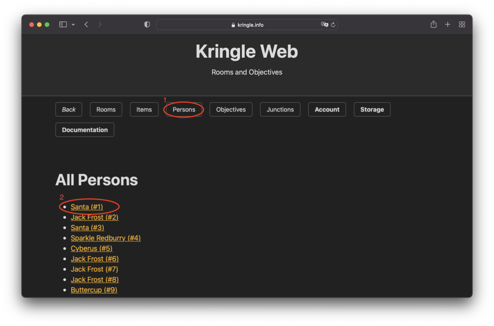
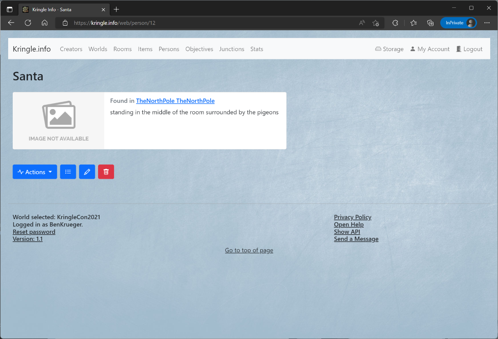

# Persons

## All Persons

You can see which persons are available by clicking on the (1) *Persons* button.  
If you click on an (2) entry, you will be taken to the detailed view.  

## Detailed View

In the detailed view you can inform yourself about the person.  
When you click on the (1) room, you can jump directly to the detailed view of the respective room of which this person is part.  
The (2) description provides a brief information about this person.  
When you click on (3) *All Persons* you will get back to the persons overview.  

