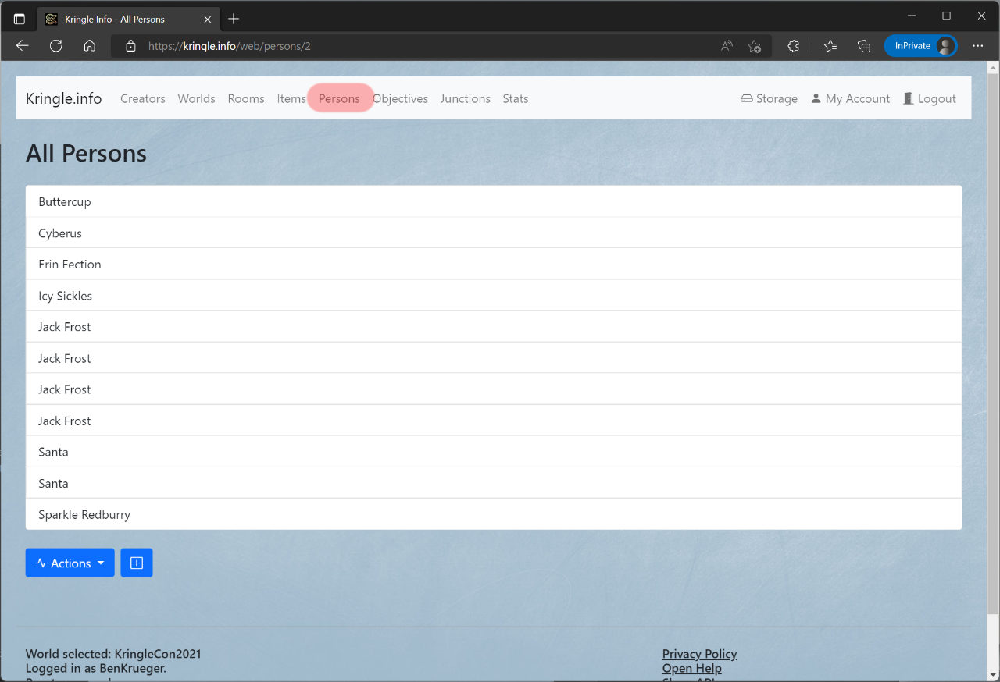

# Persons

## All Persons

You can see which persons are there by clicking on *Persons*.  
This is only possible if you have selected a world before.   

If you click on an entry, you will be taken to the detailed view.  

## Detailed View

In the detailed view you can inform yourself about the person.  
When you click on the *room*, you can jump directly to the detailed view of the respective room which this person is part of.  
If the person has an image linked, it will be displayed here as well.  
The *description* box provides brief information about this person.  

In the section below, you can access following actions:

* The *list* symbol leads back to the persons overview
* The *pencil* symbol allows you to edit the person description and the linked image (`creator` role necessary, and world ownership)
* The *trashcan* symbol will irrevocably delete that person

*Note*: The same actions can be accessed via the *Actions* drop-down menu

