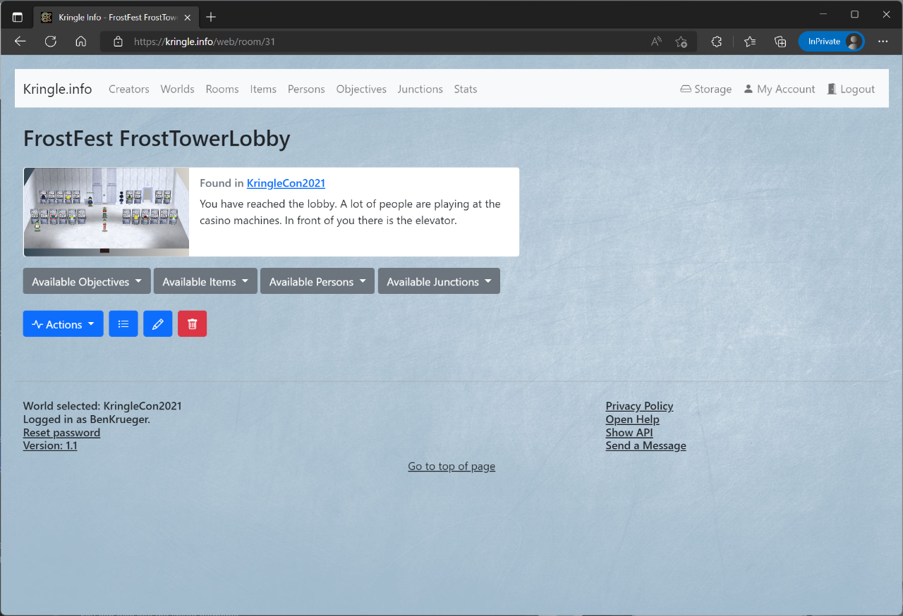

# Rooms

## All Rooms

You can see which rooms are available by clicking on *Rooms*.  
This is only possible if you have selected a  world before.   

If you click on an entry, you will be taken to the detailed view.  

In the section below, you can access following actions:  

- The *plus* symbol lets you create a new room (`creator` role necessary and world ownership)

*Note*: The same actions can be accessed via the *Actions* drop-down menu

## Detailed View

In the detailed view you can inform yourself about the room.  
When you click on the *world*, you can jump directly to the detailed view of the respective world which this room is part of.  
If the room has an image linked, it will be displayed here as well.  
The *description* box provides brief information about this room.  

You can also see the linked elements

- *Available Objective* shows all objectives which can be found in that specific room
- *Available Items* shows all items found there
- *Available Persons* shows all persons found there
- *Available Junctions* shows all junctions found in that room linking it to other rooms

In the section below, you can access following actions:

* The *list* symbol leads back to the rooms overview
* The *pencil* symbol allows you to edit the room description and the linked image (`creator` role necessary, and world ownership)
* The *trashcan* symbol will irrevocably delete that room. Please be cautious as this will also delete any solution submitted for the challenges in this room. (`creator` role necessary, and world ownership)

*Note*: The same actions can be accessed via the *Actions* drop-down menu

