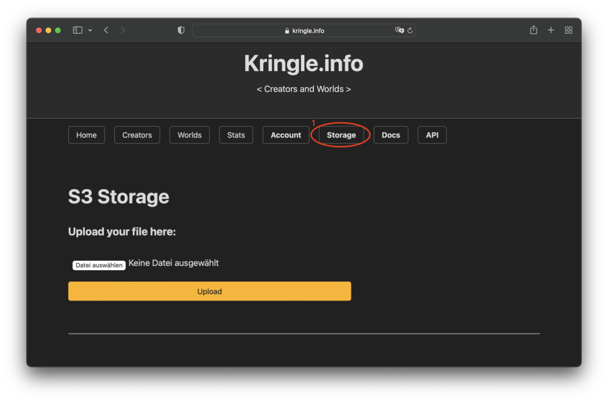

# Storage

## S3 Storage

### Upload images

If you are already logged in, you can use the included S3 Storage to upload image files. To do this, click on *Storage* (user role `user` or `creator` necessary).  

In the first section, you can upload image files. First select the respective file and then click *Upload*.  

There is even an easier way to upload images. By pressing ctrl-v (or your shortcut for paste) on that page the clipboard's content will be uploaded automatically.   
*Note*: This way the filename will be generated using the current timestamp. This is only working if the clipboard is containing image data!

### Modify images 

In the second section, you can manage files that have already been uploaded.  

- The *eye* symbol displays that image in the browser
- The *download* symbol lets you download that image again
- The *pencil* symbol lets you change the filename
- The *trashcan* symbol deletes that image
- The *link* symbol copies an HTML link to that image into your clipboard, so you can use it anywhere
- The *markdown* symbol copies the same link in Markdown format, so you can use it in your solutions

*Note*: You can use the search field to filter the files (just enter a pattern). 

