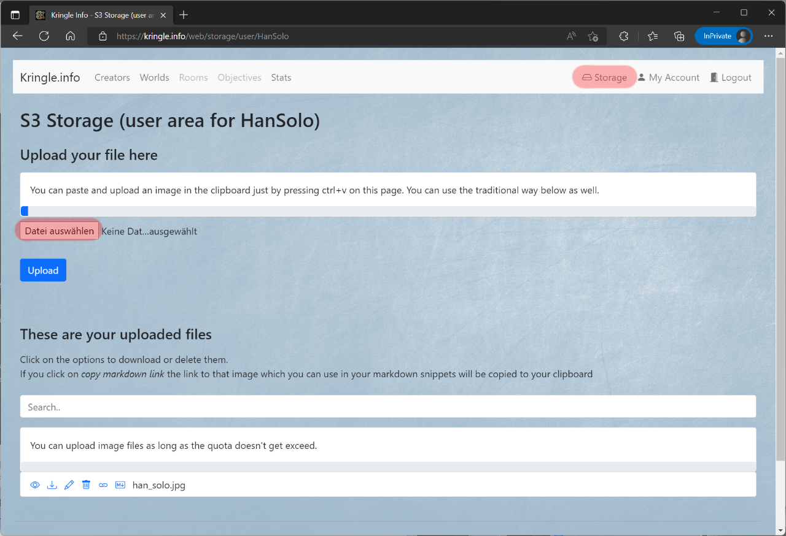

# Storage

## S3 Storage

If you are already logged in, you can use the included S3 Storage to store image files. To do this, click on (1) *Storage*.  

In the first section, you can upload image files. First select the respective file and then click *Upload*.  

In the second section, you can manage files that have already been uploaded.  
You can download or delete them again by clicking the appropriate link.  
For each file, you can also generate an appropriate Markdown link that you can paste into your solutions.  

