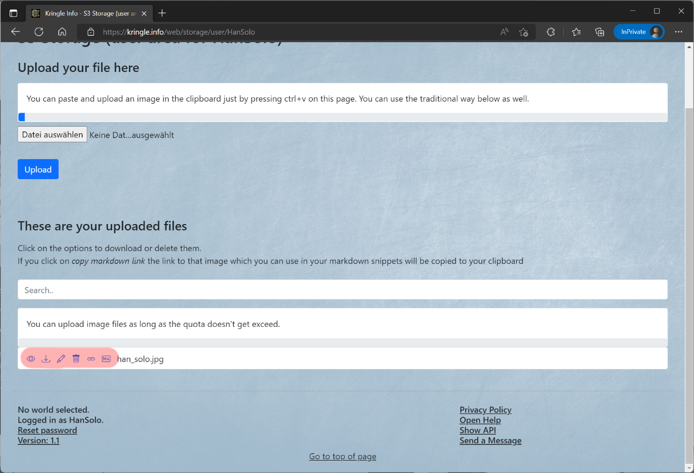

# Storage

## S3 Storage

If you are already logged in, you can use the included S3 Storage to store image files there. To do this, click on (1) *Storage*.  

In the (2) first section, you can upload image files. First select the respective file and then click *Upload*.  

In the (3) second section, you can manage files that have already been uploaded.  
You can download or delete them again by clicking the appropriate link.  
For each file, you will also see the appropriate Markdown link that you can copy into your solutions.  

