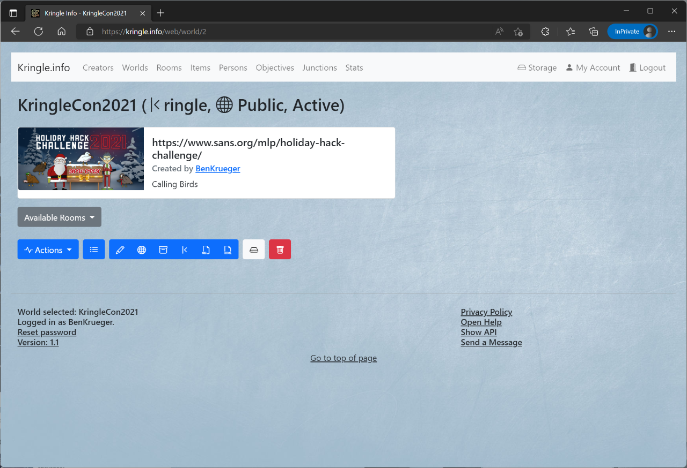
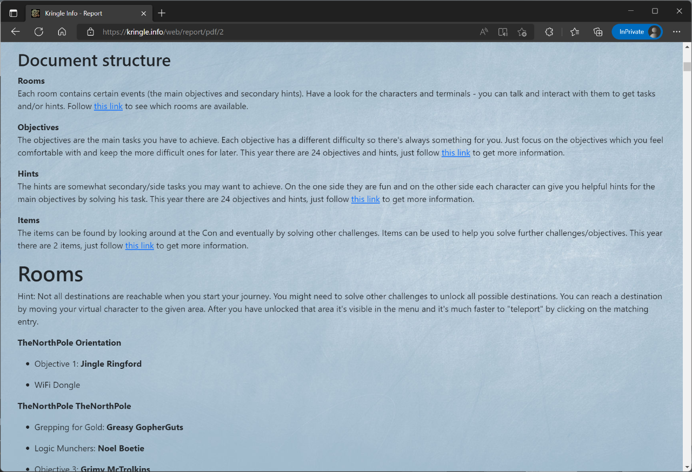

# Worlds

## All Worlds

You can see which worlds are available by clicking on *Worlds*.  
Worlds which are public (their solutions can be seen by anyone) have a special badge.  

If you click on an entry, you will be taken to the detailed view.  

## Detailed View

In the detailed view you can inform yourself about the respective world. The title also shows if this world is public or still closed.    
When you click on the *creator*, you can jump directly to the detailed view of the respective creator.  
If the world has an image linked, it will be displayed here as well.  
The *description* box below provides brief information about this world and a link to its homepage/location.  

Below are some actions you can perform for this world. Please note that it depends on your role which actions are available.

* When you click on *All Worlds* you will get back to the worlds overview.  
* By clicking on *Select World* you will be taken to the *Rooms and Objectives* section specifically for this world. Here are the individual elements that make up this world.  
* You can edit the name, URL, description or Image URL again by clicking on *Edit World* 
* By clicking on *Switch Visibility* you can set the status to *public*. Only if the status is public, other people can view submitted solutions. If the world is not public, you only see your own solutions. 
* By clicking on *Create Report* you can create a report/solution document. On the one hand, this contains the general information about the world, on the other hand, the solutions you have submitted. 
* If you click on *Delete World* this world as well as all elements will be irrevocably deleted. Please be cautious as this will also delete any solution submitted for the challenges in this world.

### Report formats

A report can be in HTML format. This format can be viewed in the browser and does contain clickable links.  
It also can be exported to other formats like PDF for example.

A report can also be in Markdown format (preferred format). The result is optimized to be viewed in Markdown editors like Typora.  
Using these tools they can be exported to PDF as well.

