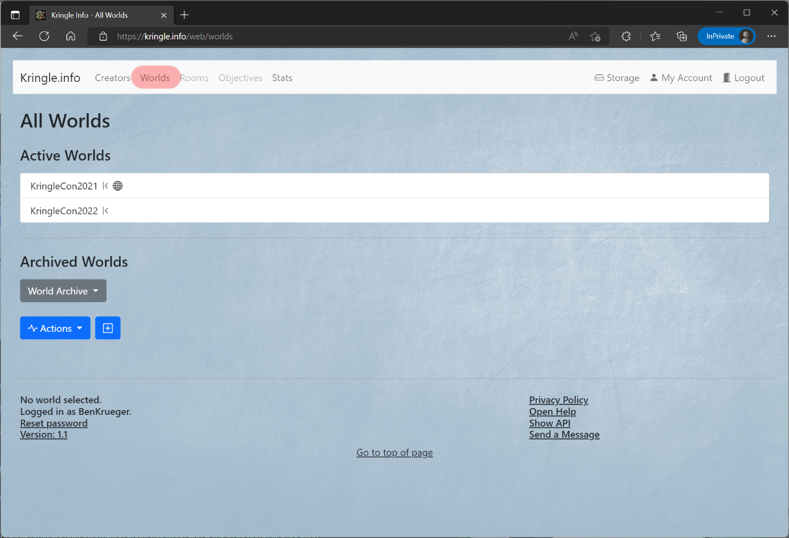

# Worlds

## All Worlds

You can see which worlds are available by clicking on *Worlds*.  
Worlds which are public (their solutions can be seen by anyone) have a special badge.  

If you click on an entry, you will be taken to the detailed view.  

- Active worlds are visible on the page index as well as on the worlds overview.
- Archived worlds are only visible in the *World Archive* on this page.

In the section below, you can access following actions:  

- The *plus* symbol lets you create a new world (`creator` role necessary)

Note: The same actions can be accessed via the *Actions* drop-down menu

## Detailed View

In the detailed view you can inform yourself about the respective world. The title also shows if this world is public or still closed.    
When you click on the *creator*, you can jump directly to the detailed view of the respective creator.  
If the world has an image linked, it will be displayed here as well.  
The *description* box below provides brief information about this world and a link to its homepage/location.  

You can also see the linked elements

- *Available Rooms* shows all rooms which can be found in that specific world

In the section below, you can access following actions:  

- The *list* symbol leads back to the worlds overview
- The *pencil* symbol allows you to edit the world description and the linked image (`creator` role necessary, and world ownership)
- The *world* symbol sets the world visibility (`creator` role necessary, and world ownership)
    - Open: Everyone is able to see public solutions
    - Closed: No one is able to see solutions (public or not)
- The *box* symbol archives the world (`creator` role necessary, and world ownership)
    - Active: The world is visible on the page index and the worlds overview
    - Archived: The world is only visible on the world archive
- The *|<* symbol marks the world as Kringle or Standard (`creator` role necessary, and world ownership)
    - Kringle: The navigation shows all elements like items, persons and junctions
    - Standard: The navigation shows only the basic set like rooms and objectives
- The *MD* symbol lets you create a markdown report (`user` role necessary)
- The *HTML* symbol lets you create an HTML report (`user` role necessary)
- The *disk* symbol leads to the storage area especially for that world (`creator` role necessary, and world ownership)
- The *trashcan* symbol will irrevocably delete that world. Please be cautious as this will also delete any solution submitted for the challenges in this world. (`creator` role necessary, and world ownership)

Note: The same actions can be accessed via the *Actions* drop-down menu

### Report formats

A report can be in HTML format. This format can be viewed in the browser and does contain clickable links.  
It also can be exported to other formats like PDF for example.

A report can also be in Markdown format (preferred format). The result is optimized to be viewed in Markdown editors like Typora.  
Using these tools they can be exported to PDF as well.

